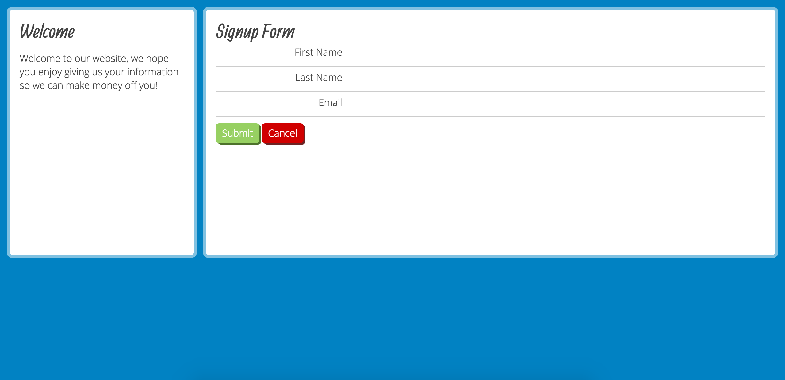

# CSS Basic Layout

The goal of this project is to focus on the basics of layout and organizing your CSS. Be sure to choose the colors from this screenshot exactly. In your career, graphic designers will probably make compositions (called "comps") to show you what the design should look like. It's your job to accomplish it with CSS. As a CSS developer, it's not so important to get the exact pixel dimensions correct for every last part, as long as the proportions are very close to the comp. However, graphic designers don't want you to deviate from their color choices.

We start you off with a basic CSS file that will help you organize your CSS into these basic roles:

- Inherited Styles (100% done for you)
- Defaults
- Helpers
- Layouts
- Components

It's your job to finish the rest. The two fonts used on the project are from Google Fonts. They are:

- Allan (font-weight normal)
- Open Sans (font-weight 300)