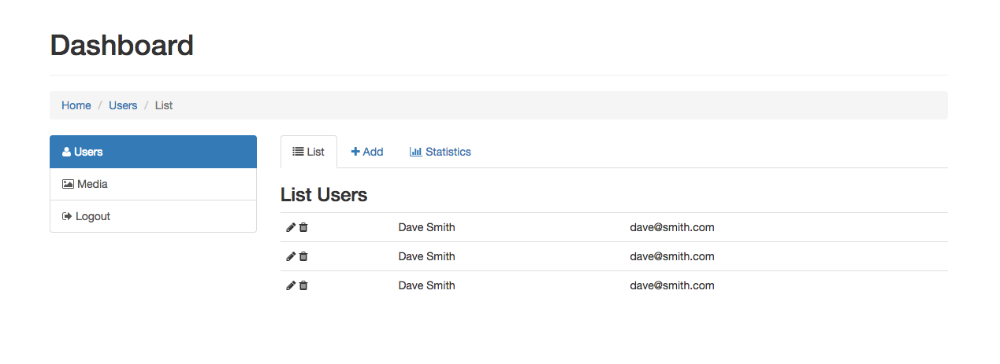
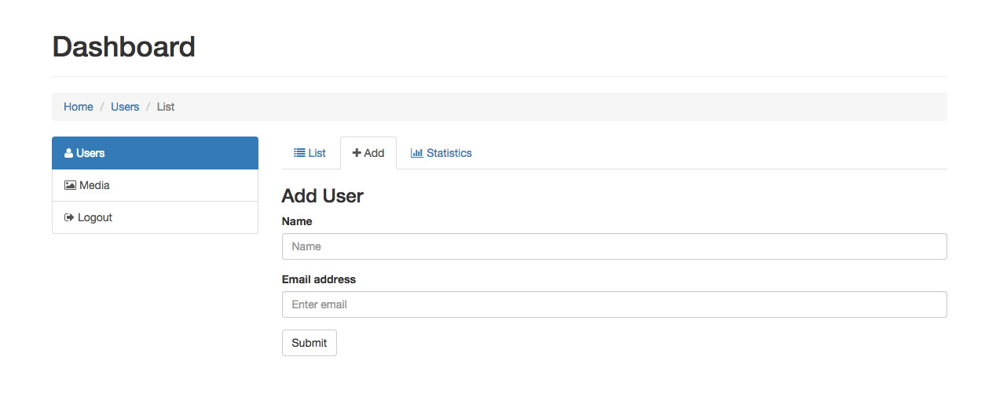

# CSS Dashboard Project

## Objectives

This project will teach you how to build a site using [Twitter Bootstrap](http://getbootstrap.com/) version 3.x. You will build the HTML layout using Bootstrap's [Grid System](http://getbootstrap.com/css/#grid). Then you will build out each component by examining the HTML and CSS class names necessary from the Bootstrap docs to accomplish these three pages:

### List Users:



### Add User Form:



### Statistics:


Note that you will also need to make use of [Font Awesome](http://fortawesome.github.io/Font-Awesome/) for the icons and [High Charts](http://www.highcharts.com/) for the spline chart.

Besides loading Bootstrap's CSS file, you will also need to load their JavaScript file since some of their components have this JavaScript file as a dependency.
Also, you will need jQuery for Bootstrap (Since Bootstrap's JS file needs jQuery) and also because you will utilize it for High Charts as well.

## Bower

Utilize Bower to download your CSS and JS assets. Start by initiating your `bower.json`. Type this command in terminal (be sure that you're on the web root of your project)

```sh
bower init
```

Answer yes to all the questions. The end result is a `bower.json` file will be created. Then type:

```sh
bower install jquery --save
bower install bootstrap --save
bower install font-awesome --save
bower install highcharts-release --save
```

After doing this, you should have this entry in your `bower.json` file:

```json
"dependencies": {
  "jquery": "~2.1.4",
  "bootstrap": "~3.3.5",
  "highcharts-release": "~4.1.7",
  "font-awesome": "~4.3.0"
}
```

And you should now have a `bower_components` folder. Now you can seek out the appropriate JavaScript files and CSS files that you'll need to include to your project. For instance, to include jQuery you can use this:

```html
<script src="/bower_components/jquery/dist/jquery.js"></script>
```

## Starting the HTML

The starting point provides you with `.container` which you will use to wrap your entire HTML codebase. `.container` is a special class name to Bootstrap and will create a centered container using `margin: 0 auto`

This project is somewhat of a scavenger-hunt to seek out which component on Bootstrap's documentation matches what the UI wants you to build. Most of the components on this project can be easily copied and pasted strait from the documentation into the project with little change. For instance, the first two components are Bootstrap's "Page Header" component and "Breadcrumbs" component.

Note that this project should be accomplished without you writing one line of CSS.

## Font Awesome

Font Awesome is an icon library that internally makes use of CSS3's custom font technology to coordinate the icons to class names. In other words, you get to use class names like this:

```html
<i class="fa fa-user"></i>
```

To create icons [like this](http://fortawesome.github.io/Font-Awesome/icon/user/)

Note that the folks over at FontAwesome are somewhat abusing the meaningfulness of the icon element, they're basically re-commissioning it as an "icon" element. It's somewhat of an abuse of how we're supposed to do HTML, but most see it as just being funny.

Note that if you wanted to make a link with an icon flanking to the left of the text:

```html
<a href="" class="fa fa-user">This is wrong</a>
<a href=""><i class="fa fa-user"></i> This is correct</a>
```

Also note that each icon will have an `fa` class (which stands for font-awesome) and also has an `fa-*` class which is the actual icon you're grabbing

## High Charts

There are many charting libraries out there (usually made with JavaScript). High Charts is one of the notable ones. To use high charts, you'll need to create a div tag to place the chart inside:

```html
<div class="user-signup-chart"></div>
```

Then you'll need to seek out that element with jQuery and attach the chart to it as follows:

```js
$('.user-signup-chart').highcharts({ ... });
```

Obviously this should all be done within a "document-dot-ready" block of code since you're trying to seek out DOM to alter it when the page loads. 

Notice that it seems that the `.highcharts` method is a jQuery method? That's because you'll be loading the High Charts JavaScript file along with jQuery which will add this method to jQuery. This is essentially how jQuery plugins work - they augment the jQuery code to give it new methods. 

Also notice that we're calling the method and passing an object literal in for the settings. Those settings are removed here and you'll need to figure out which settings are necessary. See [the docs](http://www.highcharts.com/demo/areaspline) and click the "View Options" button which will show you the settings that were used to make the spline graph on this docs page. You can copy these settings and trim out the unnecessary ones to achieve the exact graph we used to make the screen-shot UI

## Acceptance Criteria

The project must make use of Twitter Bootstrap's Grid System and components to accomplish the visual UI that you have been provided with. In addition to Bootstrap, you will also need to use High Charts and Font Awesome to achieve the UI. You will not be allowed to write any of your own CSS on this project. Also, since this project makes heavy use of third-party tools, we would like you to use Bower to download these tools instead of using a CDN

## Extra Credit

If you'd like to challenge yourself further, feel free to add additional tabs and components.