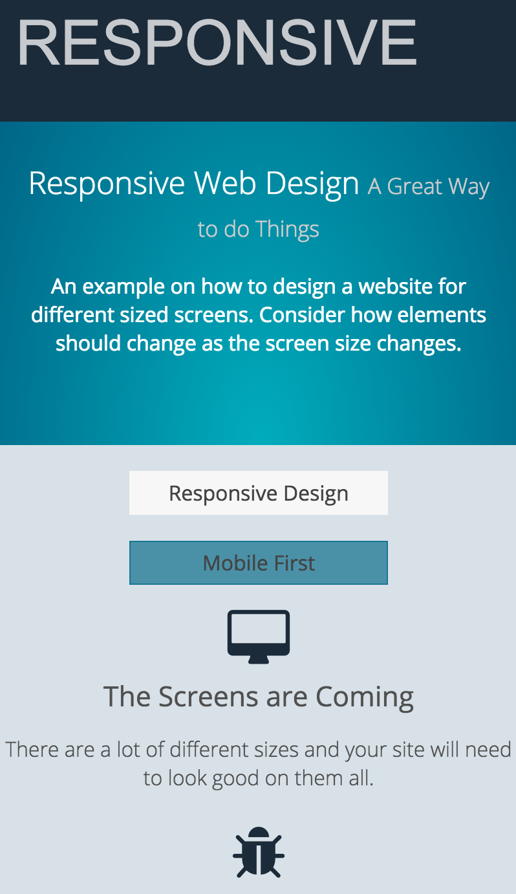
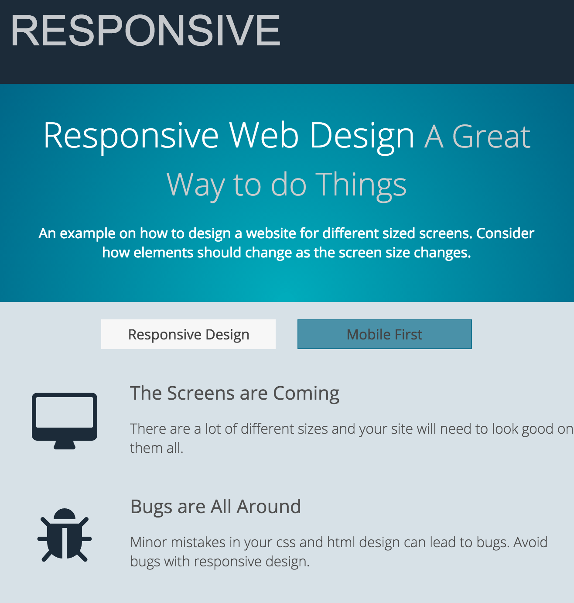

# CSS Responsive

This project serves to reinforce CSS Responsive Layout.

### Objectives

After completing this assignment, you should be able to use css media query to apply styles:

- Demonstrate media query syntax
- Describe Break points 

## Acceptance Criteria

- Your site will look like  when the screen is small
- Your site will look like   when the screen is large

## Instructions

You will edit properties in the `styles.css` to make the site responsive to different screen sizes

Review `index.html` to understand how the page is constructed.

Choose the appropriate property and copy it to the correct selector in `styles.css`.
