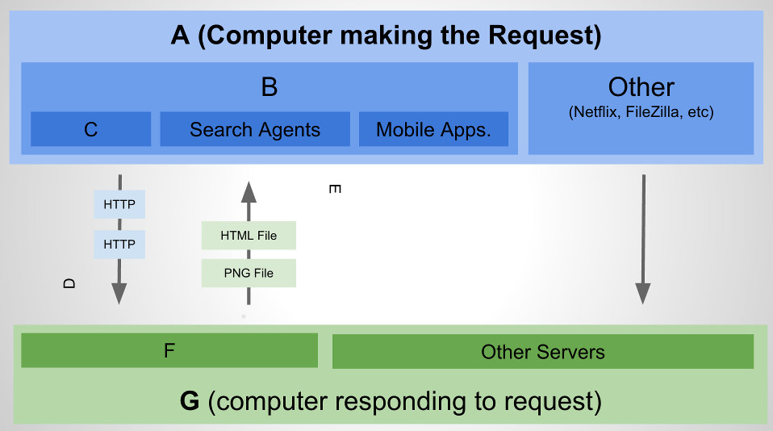

# What's Http

This project serves to reinforce Basic HTTP Concepts.

### Objectives

After completing this assignment, you should be able to explain common status codes, and common terms:

- Explain Common HTTP Status Codes
    - 200: Ok
    - 301: Redirect
    - 404: Page not found
    - 500: Internal Server Error
- Explain terms:
    - Client vs. User Agent vs. Browser
    - Server
    - "Stateless" Requests

## Acceptance Criteria

- Match Terms with Correct Item on Image (A, B, C, ...)

| Letter         | Term           
| ------------- |-------------  |
|               | The Response  | 
|               | Browser       |
|               | User Agent    |
|               | The Request   |
|               | Server        |
|               | Client        |
|               | Web Server    |

- Draw a line between the Code and the Term

| Code |   | Term           
| ------|---|------|
| 200   |   | Redirect
| 301   |   | Internal Server Error
| 404   |   | Ok
| 500   |   | Page not found
