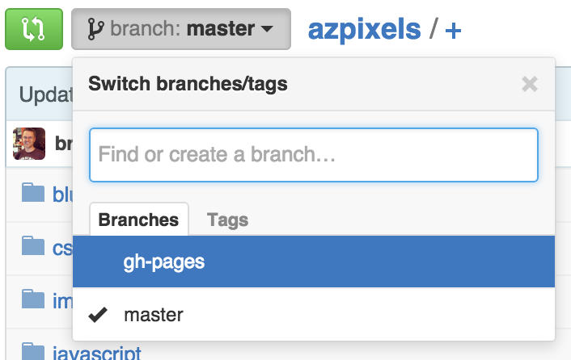

# Jekyll Blog

The purpose of this project is to create a blog/portfolio for yourself to have upon graduation. You can actually create a website about any topic you like, but if you're having a difficult time with ideas then a blog and/or portfolio of your work is best.

This project is ongoing and you should achieve different milestones of this project at different intervals of the overall class. Ask your teacher which milestones need to be achieved at which intervals of the class.

## Create a local Jekyll project

1. Create a new Jekyll project
1. Create at least one original blog post. Topic ideas might be:
    - What the first few weeks of the bootcamp have been like
    - Your experiences that led you to join a bootcamp
    - What your favorite technology is that you've learned and why

## Hosted at GitHub Pages

1. Use `git init` to turn your Jekyll project into a git repo
1. Create a separate branch called `gh-pages`
1. Create a new repo at GitHub to match the local one
1. `push` your code to GitHuvb including the `gh-pages` branch

Be sure that you also add your `gh-pages` branch to your remote at GitHub:

```sh
git push origin gh-pages
```



It might take a few minutes (15 at the most) for your site to become "live" the first time you push the code to the `gh-pages` branch, but when it's ready you should be able to go to `http://[your-user-name].github.io/[repo-name]` to see your project

## Design your blog

Separately from your Jekyll project, create a static HTML and CSS website that you'll use on your blog. Build them separately with the idea that we will introduce this code into the Jekyll project when it's finished (this is called "sandboxing")

When you're satisfied with how your HTMl and CSS looks in your sandbox, introduce the HTML and CSS into the Jekyll blog piece-by-piece (you'll probably need to break your sandbox HTML down into re-usable templates for Jekyll).

How you have a blog! All you need to do now is create more pages