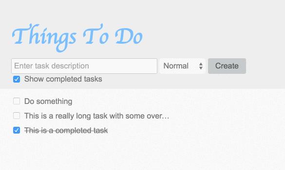
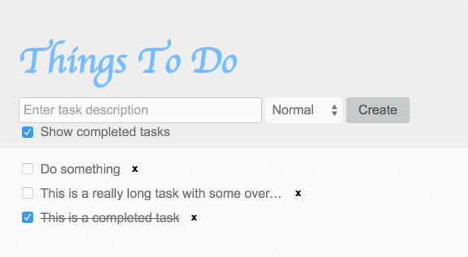

# ToDo App
Create a simple ToDo app that allows creating new tasks, marking tasks as completed, and task importance levels.

## Acceptance Criteria

### Basic features



- As a user, I should be able to create new tasks by entering a task description and clicking a "Create" button
- As a user, I should be able to set the importance of the task (low, normal, high) via a dropdown when creating a new task
- As a user, I expect the default importance level to be "normal"
- As a user, I should be able to checkmark individual tasks to indicate the task was completed
- As a user, I should be able to uncheck individual tasks to undo the completed state

### Advanced features



In addition to the basic features

- As a user, I should be able to remove (delete) a task from the list permanently

## HTML Structure

The project is broken down into two main sections in `<body>`: `header` and `section#tasks`

```html
<header></header>
<section id="tasks"></section>
```

The header will only consists of the `<form>` and a checkbox `<input>` for showing and hiding completed tasks:

```html
<header>
	<h1>Things To Do</h1>

	<form id="create-task">
  		<input id="create-text" type="text" placeholder="Enter task description">
	  	<select name="importance" id="create-importance">
   			<option value="low">Low</option>
	    	<option value="" selected>Normal</option>
			<option value="high">High</option>
  		</select>
		<input id="create-btn" type="button" value="Create">
	</form>

	<input id="show-completed" type="checkbox" checked>
	<label for="show-completed">Show completed tasks</label>
</header>
```

The `#tasks` section will have it's direct children elements be `.task`s. Some are already made for you so you can see the structure. Others will be created dynamically:

```html
<div class="task">
	<input id="task-1" type="checkbox">
	<label for="task-1" class="text">Do something</label>
</div>
```

A new task will be created programmatically each time the user clicks the `#create-btn` button in the `header`. If the user has not entered any text in the text field, no new task will be created.


## State Management

Be sure to study the CSS and see how it works. The state of each task is managed via the state of the associated checkbox.

```css
.task input:checked + .text {
 	text-decoration: line-through;
}
```

Tasks that have "low" or "high" importance will have an additional class of `low` or `high` respectively.

```html
<div class="task low">
	<input id="task-42" type="checkbox">
	<label for="task-42" class="text">Low priority task</label>
</div>
```

# Guide

You will only need 2 jQuery event handlers for this project and a template rendering function. Follow this guide to ensure success.

## Generating new DOM

Use jQuery to generate HTML in the format of the tweet (see above). You will have to set certain attributes based on values. For instance, if "importance" is "low", add the "low" class to the `div.task` element.

Create a function that accepts an `Object` and `return`s the rendered template string.

```js
function generate(details) {

}
```

Use jQuery's DOM generation syntax to create each element and assign the necessary attributes and values.

```js
// creating a new <div class="foo" id="bar"> by example
$('<div>', {
  class: 'foo',
  id: 'bar'
})
```

Test the function by calling the function with a data Object and console logging the output.

## Creating a task

Create a jQuery click event handler for the "Create" button that does the following (you will need to figure out the optimal logical order of operations)

- retrieve the value from the text input
- retrieve the value from the select dropdown
- get the generated DOM by passing the values to your generate function
- `if` condition checking if there is any text in the text input
- append the new task to the `#tasks` container

## Showing or hiding completed tasks

Create a jQuery click event handler for the "Show completed tasks" checkbox. If this checkbox is checked, completed tasks should be visible. If this checkbox is unchecked, completed tasks should be hidden. Determine the optimal logical order of operations for the following.

- Use an `if..else` statement to determine which action to take (show vs hide)
- Find all tasks with a checked checkbox (completed tasks)
- Show or hide the the completed tasks based on the current state of the "show completed tasks" checkbox.

# Extra Credit (Advanced features)

Add a remove button to each task. When clicked, the remove button should remove the task from the DOM. Styling for the remove button is provided for you. Examine the CSS to see what you would need to add to your template. Don't forget to write your event handler!
